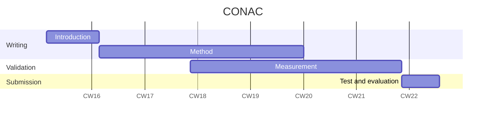

# F1/10 Gym Environment (Python 3.12 Compatible)

This repository hosts a stable, updated fork of the F1/10 Gymnasium environment, primarily targeting Python 3.12 for enhanced performance and compatibility with modern scientific computing libraries. This version is ideal for developing and integrating projects, such as the ROS Bridge, which require a stable simulation backend.

**Status:** Fully tested and stable on Python 3.12.

## Key Features & Compatibility

- **Python 3.12 Support:** All core components, including Numba JIT functions, have been verified and updated for Python 3.12 stability.
- **Gymnasium API:** Utilizes the modern gymnasium interface (gym.make, env.step with terminated/truncated).
- **Stable Map Loading:** Fixes the common installation issue by correctly accessing package data (maps, YAML files) using importlib.resources.
- **Multi-Agent Ready:** Supports the default 2-agent configuration out-of-the-box.

## Quick Installation

It is highly recommended to use a dedicated Python 3.12 virtual environment (venv).

### 1. Setup and Clone

```bash
# Install Python 3.12 venv package (If required on Ubuntu/Debian)
sudo apt install python3.12-venv

# Clone the repository
git clone https://github.com/samuelnaol72/f110-gym-py312.git
cd f110-gym-py312

# Create and activate environment
python3.12 -m venv f110_py312_env
source f110_py312_env/bin/activate
```

### 2. Install Dependencies and Library

This command installs all required packages (listed in requirements.txt) and sets up the library in editable mode (-e .).

```bash
# Install dependencies (Numba, Gymnasium, Pyglet, etc.)
pip install -r requirements.txt

# Install the F1/10 library locally (includes map data)
pip install -e .
```

## ROS Bridge Integration Notes

For integration with the ROS Bridge, use the following guidelines:

### Headless Mode

Initialize the environment with `render_mode=None` for server-side or non-visual use:

```python
env = gym.make('f110_gym:f110-v0', render_mode=None, num_agents=1)
```

### Action Format

Actions must be passed as a NumPy array of shape `(num_agents, 2)`. For a single agent, this is `(1, 2)`.

### Observation Conversion

The ROS Bridge must map the keys from the observation dictionary (`obs`) back to standard ROS messages:
- `scans` → `LaserScan`
- `poses_x/poses_y/poses_theta` → `PoseStamped/tf`

For detailed troubleshooting, API descriptions, and advanced setup options, please refer to the comprehensive manual.

---

# Constrained Optimization-Based Neuro-Adaptive Control (CONAC)

- Paper Name: TBD
- State: TBD
- Template Version: Robot Branch

> [!Note]
> This paper will be submitted to [IEEE Transactions on Cybernetics](https://ieeexplore.ieee.org/xpl/RecentIssue.jsp?punumber=6221036).

You can find papers here:

- First submission: 
<!-- - Final submission: [still working](./manuscript.pdf) -->

## About this Research

The objective of this research is to design neuro-adaptive controller using constrained optimization theory. 
The main features are as follows.

- Stability of controller is ensured in the sense of Lyapunov.
- Weights of neural network and tracking error are bounded over time.
- Constraints are satisfied while adaptation (learning)
    - Weight norm constraint.
    - Control input saturation constraint (which is convex).

## Authors

- [Myeongseok Ryu](https://github.com/DDingR)
- Donghwa Hong
- Kyunghwan Choi

# Gantt Chart




